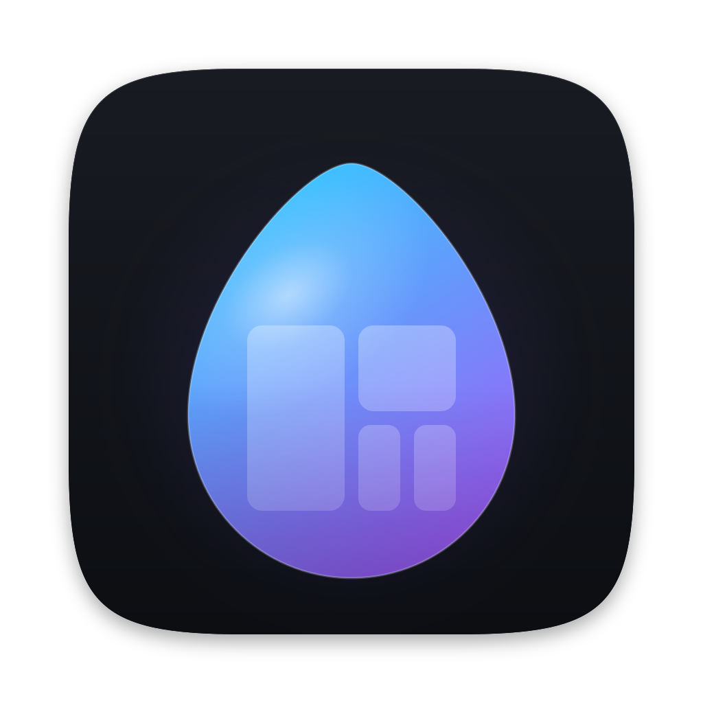

<p align="center"></p>

# hyprdarwin

A personal, Hyprland-inspired tiling window manager for macOS.

- Configured in Lua with a subset of Hyprland's own `hl.*` API, in a text file the app never writes.
- Dwindle and master layouts plus tmux's seven (HYPR + SHIFT + SPACE loops through them like tmux's next-layout), tiling that respects each app's minimum window size, virtual Hyprland-style workspaces (numbered, created on demand, plus special scratchpads), window rules, submaps.
- A built-in Hypr key: Caps Lock becomes a modifier while hyprdarwin runs (no Karabiner needed).
- `hyprdarwinctl`, a hyprctl-style command line client, and an event socket that streams Hyprland's event names.
- A read-only settings window showing the options, binds and rules in effect and the config's errors.
- Uses only the Accessibility API and SIP-safe calls: System Integrity Protection stays on.

Target: macOS 26 on Apple Silicon. This is a personal tool; it is not tested anywhere else.

## Install

### Homebrew

```sh
brew tap brucechanjianle/hyprdarwin
brew install --cask brucechanjianle/hyprdarwin/hyprdarwin
open /Applications/hyprdarwin.app
```

The cask also links `hyprdarwinctl` into Homebrew's `bin`. Upgrade with `brew upgrade --cask hyprdarwin`. The cask comes from the [BruceChanJianLe/homebrew-hyprdarwin](https://github.com/BruceChanJianLe/homebrew-hyprdarwin) tap, which the release workflow updates (see [Releasing](#releasing)). Uninstalling quits the app; `brew uninstall --zap` also removes its log and preferences, never your config.

### nix-darwin

With [nix-homebrew](https://github.com/zhaofengli/nix-homebrew):

```nix
homebrew = {
  taps = [ "brucechanjianle/hyprdarwin" ];
  casks = [ "brucechanjianle/hyprdarwin/hyprdarwin" ];
};

# Homebrew refuses to load casks from non-official taps until trusted.
nix-homebrew.trust.casks = [ "brucechanjianle/hyprdarwin/hyprdarwin" ];
```

### Latest CI build

Every push runs `.github/workflows/build.yml`: tests, then a signed `hyprdarwin-app` artifact. To try an unreleased build:

```sh
run=$(gh run list --repo BruceChanJianLe/hyprdarwin --workflow build --branch master --status success --limit 1 --json databaseId --jq '.[0].databaseId')
gh run download "$run" --repo BruceChanJianLe/hyprdarwin --name hyprdarwin-app --dir /tmp/hyprdarwin
ditto -x -k /tmp/hyprdarwin/hyprdarwin.zip /Applications
open /Applications/hyprdarwin.app
```

`hyprdarwinctl` is inside the app: `/Applications/hyprdarwin.app/Contents/MacOS/hyprdarwinctl` (link it into your `PATH`, or install with Homebrew).

### Running

hyprdarwin lives in the menu bar (no Dock icon). Its menu shows the version, e.g. `Version 0.2.0 (abc1234, run 57)`: the release, the git commit and the CI run that built it. So do About hyprdarwin, the first log line and `/Applications/hyprdarwin.app/Contents/MacOS/hyprdarwin --version`. The release number lives in the `VERSION` file.

### Grant Accessibility

On first launch macOS shows "hyprdarwin would like to control this computer using accessibility features".

1. Click **Open System Settings** (or open **System Settings > Privacy & Security > Accessibility**).
2. Turn on the switch next to **hyprdarwin**.

hyprdarwin notices the grant within a second and starts tiling; no relaunch needed. The menu bar shows a lock icon until then.

The grant is tied to the app's code signature. With a stable signing identity (next section) it survives updates. Without one, every new build looks like a different app: remove the old **hyprdarwin** entry with the minus button and enable the new one.

### Stable signing identity (keeps the Accessibility grant across updates)

Create a self-signed code-signing certificate once and give it to CI:

```sh
scripts/make-signing-identity.sh          # writes build/signing/hyprdarwin-local.p12, asks for your login password to trust it
base64 -i build/signing/hyprdarwin-local.p12 | gh secret set HYPRDARWIN_SIGNING_P12
gh secret set HYPRDARWIN_SIGNING_PASSWORD < build/signing/hyprdarwin-local.password
```

Keep `build/signing/` private (it is git-ignored). From then on CI signs every build with that certificate, and so does `scripts/build-app.sh` on a machine that has it in the keychain. Until the secrets exist, CI signs with a throwaway certificate and the workflow prints a warning.

### Building locally

Only Apple's Command Line Tools are needed (`xcode-select --install`), no Xcode:

```sh
swift build
swift test      # see AGENTS.md if the Swift Testing macro plugin is not found
scripts/build-app.sh   # -> build/hyprdarwin.app (with Contents/MacOS/hyprdarwinctl), signed with "hyprdarwin-local" if present, else ad-hoc
```

### Releasing

1. Bump `VERSION` (e.g. `0.3.0`) and merge it to `master`.
2. Tag that commit and push the tag: `git tag v0.3.0 && git push origin v0.3.0`.

`.github/workflows/release.yml` then checks the tag equals `v` + `VERSION`, runs the tests, builds and signs the app with the stable identity (it refuses to release without `HYPRDARWIN_SIGNING_P12`), publishes `hyprdarwin-0.3.0.zip` and its `.sha256` on a GitHub Release, renders `packaging/homebrew/hyprdarwin.rb` into the tap's `Casks/hyprdarwin.rb` and commits it. Change the cask and the tap's README in `packaging/homebrew/`, never in the tap.

The tap commit needs the `HOMEBREW_TAP_TOKEN` secret: a fine-grained personal access token limited to BruceChanJianLe/homebrew-hyprdarwin with **Contents: Read and write**. If publishing fails, fix the cause and run the workflow by hand (Actions > release > Run workflow, with the tag, or `gh workflow run release -f tag=v0.3.0`): a release that already has its zip is reused, not rebuilt, so the checksum stays the same.

The cask removes the quarantine attribute after install because the app is self-signed, not notarized.

## Caps Lock as the Hypr key

While hyprdarwin runs it maps Caps Lock to F18 with `hidutil` and treats F18 as the `HYPR` modifier. Quitting (or Pause) gives Caps Lock back; a mapping you had on Caps Lock yourself is restored too.

This needs **System Settings > Keyboard > Keyboard Shortcuts > Modifier Keys > Caps Lock** left on **Caps Lock**. Use `hd.config({ hypr_key = "f18" })` if something else already sends F18, or `"none"` to use only regular modifiers.

## Configuration

The config file is the first that exists of:

1. `$HYPRDARWIN_CONFIG`
2. `$XDG_CONFIG_HOME/hypr/hyprdarwin.lua`
3. `~/.config/hypr/hyprdarwin.lua`

If none exists, hyprdarwin writes a commented default to `$HYPRDARWIN_CONFIG` if set, else to the XDG path if `XDG_CONFIG_HOME` is set, else to `~/.config/hypr/hyprdarwin.lua`. It never writes the file again.

- **Hot reload.** Saving any `.lua` file in the config's directory reloads (also through symlinks, so dotfile managers work). Menu > Reload Config does it by hand, and so does `hl.dsp.reload_config()`.
- **Errors keep the last good config.** A syntax error, a runtime error or an invalid value rejects the whole file: the previous config stays active, a red banner appears at the top of the screen and Menu > Show Errors (the settings window's Errors tab, also `hyprdarwinctl configerrors`) lists `file:line: message`. Warnings (an unknown option, a typo'd dispatcher) are applied and shown in an amber banner that fades. Notes (Hyprland options macOS cannot honour) only appear in Show Errors.
- **Sandbox.** Every load runs in a fresh Lua 5.4 state without `io`, `os.execute`, `require` of C modules or `load` of bytecode, with an instruction budget so an endless loop cannot hang the window manager. `require("name")` loads `name.lua` or `name/init.lua` from the config directory.

### Sample config

```lua
-- ~/.config/hypr/hyprdarwin.lua
local mod = "HYPR"   -- Caps Lock

hl.config({
    general = { layout = "dwindle", gaps_in = 5, gaps_out = 12 },
    dwindle = { preserve_split = true },
    master  = { mfact = 0.55, new_status = "slave", orientation = "left" },
    input   = { follow_mouse = 1 },
    misc    = { focus_on_open = false },   -- new windows open without taking focus
})

if hd then
    hd.config({ hypr_key = "caps_lock", hide_corner = "bottom-right" })
    hl.bind("HYPR + SHIFT + SPACE", hd.dsp.cycle_layout())   -- this workspace: next layout, like tmux
    hl.bind("HYPR + R", hd.dsp.retile())                     -- reapply rules, re-tile everything
end

hl.workspace_rule({ workspace = "5", layout = "master" })

hl.bind(mod .. " + RETURN", hl.dsp.exec_cmd("open -na Ghostty"), { description = "Terminal" })
hl.bind(mod .. " + Q", hl.dsp.window.close())
hl.bind(mod .. " + V", hl.dsp.window.float({ action = "toggle" }))
hl.bind(mod .. " + F", hl.dsp.window.fullscreen({ mode = "maximized" }))
hl.bind(mod .. " + SPACE", hl.dsp.layout("togglesplit"))
hl.bind(mod .. " + S", hl.dsp.workspace.toggle_special("scratch"))

for key, dir in pairs({ h = "left", j = "down", k = "up", l = "right" }) do
    hl.bind(mod .. " + " .. key,         hl.dsp.focus({ direction = dir }))
    hl.bind(mod .. " + SHIFT + " .. key, hl.dsp.window.swap({ direction = dir }))
end
for i = 1, 10 do
    local key = tostring(i % 10)
    hl.bind(mod .. " + " .. key,         hl.dsp.focus({ workspace = i }))
    hl.bind(mod .. " + SHIFT + " .. key, hl.dsp.window.move({ workspace = i }))
end
hl.bind(mod .. " + ALT + 1", hl.dsp.focus({ workspace = 11 }))   -- workspaces have no upper limit

hl.bind(mod .. " + SHIFT + R", hl.dsp.submap("resize"))
hl.define_submap("resize", function()
    hl.bind("right",  hl.dsp.window.resize({ x = 40, y = 0, relative = true }), { repeating = true })
    hl.bind("left",   hl.dsp.window.resize({ x = -40, y = 0, relative = true }), { repeating = true })
    hl.bind("escape", hl.dsp.submap("reset"))
end)

hl.window_rule({ match = { class = "^com\\.apple\\.systempreferences$" }, float = true, center = true })
hl.window_rule({ match = { class = "^com\\.tinyspeck\\.slackmacgap$" }, workspace = "3 silent" })
hl.window_rule({ match = { title = "^Picture-in-Picture$" }, float = true, size = "480 270", move = "monitor_w-500 40" })

hl.on("hyprland.start", function()
    hl.exec_cmd("open -a Ghostty")
end)
```

The generated default config (`Sources/HyprdarwinConfig/DefaultConfig.swift`) uses vim-style binds: HYPR + h/j/k/l moves focus, + SHIFT swaps, + CTRL moves (the arrow keys work too); HYPR + SPACE toggles the split and HYPR + SHIFT + SPACE goes to the next layout (dwindle, then tmux's seven); HYPR + V floats a window and HYPR + SHIFT + V cycles through the floating ones; HYPR + 1-0 and HYPR + SHIFT + 1-0 switch and move between workspaces 1-10; HYPR + N / P go to the next / previous workspace that has windows and HYPR + ] / [ to the next / previous one on this display, empty ones included; HYPR + R re-tiles, HYPR + SHIFT + R enters a resize submap, HYPR + CTRL + R reloads the config, HYPR + S toggles the scratchpad, HYPR + F maximizes. There is no HYPR + TAB bind: Caps Lock sits right next to Tab.

### API reference

Calls:

| Call | Notes |
|---|---|
| `hl.config(table)` | Options below; may be called many times, later values win |
| `hl.bind(keys, action, flags?)` | `keys` like `"HYPR + SHIFT + left"`; `action` is an `hl.dsp.*` dispatcher or a Lua function; returns a handle with `:set_enabled(bool)` and `:is_enabled()` |
| `hl.define_submap(name, function)` | Binds made inside the function belong to the submap; `hl.dsp.submap("reset")` leaves it |
| `hl.window_rule(table)` | See window rules; returns a handle with `:set_enabled(bool)` |
| `hl.workspace_rule(table)` | `workspace`, `monitor`, `default`, `persistent`, `layout`, `gaps_in`, `gaps_out` |
| `hl.on(event, function)` | `"hyprland.start"` / `"hyprdarwin.start"` (first load only), `"hyprland.shutdown"` / `"hyprdarwin.shutdown"` |
| `hl.exec_cmd(cmd)` | Runs a shell command now (at load time: on every load) |
| `hl.env(name, value)` | Exported to commands hyprdarwin runs |
| `hd.config(table)` | macOS only: `hypr_key` (`"caps_lock"`, `"f18"`, `"none"`), `hide_corner` (`"bottom-right"`, `"bottom-left"`), `unmanaged_apps` (bundle ids hyprdarwin never moves or focuses, e.g. `{ "com.mitchellh.ghostty" }`), `border_radius` (corner radius of the borders, default 12). `hd` is nil on Hyprland, so guard with `if hd then` |
| `hl.monitor`, `hl.curve`, `hl.animation`, `hl.gesture`, `hl.device`, `hl.permission`, `hl.layer_rule` | Accepted and ignored |

Calling a dispatcher runs it: `hl.dsp.focus({ workspace = 2 })()` inside a bound function, or at the top level of the config (it then runs after each load).

Keys: modifiers `HYPR`, `CMD` (aliases `SUPER`, `COMMAND`), `ALT` (`OPT`, `OPTION`), `CTRL`, `SHIFT`; keys `a`-`z`, `0`-`9`, `F1`-`F20`, `return`/`enter`, `escape`, `space`, `tab`, `backspace`, `delete`, `left`/`right`/`up`/`down`, `home`, `end`, `pageup`, `pagedown`, `minus`, `equal`, `bracketleft`, `bracketright`, `semicolon`, `apostrophe`, `grave`, `backslash`, `comma`, `period`, `slash`, or `code:<keycode>`. Flags: `repeating`, `release`, `description`.

Options:

| Option | Values |
|---|---|
| `general.layout` | `"dwindle"`, `"master"`, or one of tmux's layouts (below) |
| `general.gaps_in`, `general.gaps_out` | number, or `"top right bottom left"` (1 to 4 numbers) |
| `general.border_size` | border width in points (default 2, 0 hides borders) |
| `general.col.active_border`, `general.col.inactive_border` | border colours of the focused window (default the Hyprland gradient `"rgba(33ccffee) rgba(00ff99ee) 45deg"`) and the others (default none: unfocused windows get no border): a colour, `"rgba(..) rgba(..) 45deg"`, `{ colors = { ... }, angle = 45 }` for a gradient, or `0xAARRGGBB` |
| `dwindle.preserve_split` | keep split directions when windows change |
| `dwindle.force_split` | 0 cursor side, 1 left/top, 2 right/bottom |
| `dwindle.default_split_ratio` | 0.1 to 1.9 (1.0 even) |
| `dwindle.split_width_multiplier` | > 0 |
| `master.mfact` | 0 to 1 |
| `master.new_status` | `"master"`, `"slave"`, `"inherit"` |
| `master.new_on_top` | boolean |
| `master.orientation` | `"left"`, `"right"`, `"top"`, `"bottom"` |
| `input.follow_mouse` | 1 focus follows the cursor, 0 focus on click |
| `cursor.no_warps` | don't move the cursor to windows focused from the keyboard |
| `misc.disable_autoreload` | stop watching the config |
| `misc.focus_on_open` | `false` (default): a new window opens on its workspace (rules included) without taking focus or switching workspaces, so you stay where you are. `true`: focus follows the new window, switching workspace if needed (Hyprland's behaviour) |

Dispatchers (`hl.dsp.*`):

| Dispatcher | Arguments |
|---|---|
| `exec_cmd(cmd)` | shell command |
| `window.close()`, `window.kill()` | kill force-quits the app |
| `window.float({ action })` | `toggle` (default), `set`, `unset` |
| `window.fullscreen({ mode, action })` | `mode`: `fullscreen` (fills the screen below the menu bar) or `maximized` (inside gaps_out). The workspace's other windows are parked until it ends (or you focus one of them, or a new window opens there). Emulated; native macOS fullscreen is left alone |
| `window.move({ direction })` | swap with the neighbour, or move to the next monitor |
| `window.move({ workspace, follow })` | `follow = false` is Hyprland's movetoworkspacesilent |
| `window.move({ monitor, follow })`, `window.move({ x, y, relative })` | x/y moves floating windows |
| `window.swap({ direction })` | |
| `window.resize({ x, y, relative })` | tiled: moves the split; floating: resizes |
| `window.center()` | floating windows |
| `focus({ direction })`, `focus({ workspace, on_current_monitor })`, `focus({ monitor })`, `focus({ last = true })` | |
| `workspace.toggle_special(name?)` | default name `special` |
| `workspace.move({ monitor, workspace? })` | |
| `layout(message)` | dwindle: `togglesplit`, `swapsplit`, `splitratio <delta>` / `splitratio exact <v>`; master: `swapwithmaster`, `focusmaster`, `addmaster`, `removemaster`, `mfact <delta>` / `mfact exact <v>`, `orientation{left,right,top,bottom,next,prev}`, `cyclenext`, `cycleprev`, `swapnext`, `swapprev`, `rollnext`, `rollprev` |
| `submap(name)`, `reload_config()`, `exit()`, `no_op()` | `exit` quits hyprdarwin |
| `window.cycle_next({ floating, tiled, prev })` | focus and raise the next window of the workspace (Hyprland's `cyclenext`); `floating = true` only visits floating windows, including those floating because they do not fit, `tiled = true` only tiles, `prev = true` goes backwards |
| `hd.dsp.cycle_layout({ direction })` | hyprdarwin only: the focused workspace takes the next (`direction = "prev"`: previous) layout of `dwindle`, `even-horizontal`, `even-vertical`, `main-horizontal`, `main-horizontal-mirrored`, `main-vertical`, `main-vertical-mirrored`, `tiled`, wrapping around: dwindle, then tmux's next-layout order. Kept across reloads |
| `hd.dsp.retile()` | hyprdarwin only: re-tile. Every window gets its window rules again as if it had just opened (float or tile, `workspace` (silently), floating `size`/`move`/`center`, `fullscreen`, tags, borders; a window no rule decides keeps its floating state), every workspace's layout is rebuilt from its windows in their current order with default split ratios and mfact, and every window is written to its place again |

Workspace selectors: `3`, `"special"`, `"special:name"`, `"+1"`/`"-1"` (relative number), `"r+1"`/`"r-1"` (next/previous number on this monitor, empty ones included: numbers shown or kept on another monitor are skipped), `"e+1"`/`"e-1"` (next/previous existing), `"m+1"`/`"m-1"` (existing on this monitor), `"previous"`, `"empty"`. Monitor selectors: a name (or part of it), an index from the left, `"l"`/`"r"`/`"u"`/`"d"`, `"+1"`/`"-1"`, `"current"`.

### Window rules

```lua
hl.window_rule({
    name  = "pip",                                   -- optional
    match = { class = "^com\\.apple\\.Safari$", title = "negative:.*Private.*" },
    float = true, size = "480 270", move = "monitor_w-500 40",
})
```

- **Match fields** (all listed fields must match; regexes are unanchored ICU, `negative:` inverts): `class` (bundle id), `title`, `initial_class`, `initial_title`, `app_name`, `role`, `subrole` (`AXStandardWindow`, `AXDialog`, ...), `tag`, `float`, `fullscreen`, `workspace`.
- **Effects** (applied when the window opens; later rules win per effect): `float`, `tile`, `workspace = "N"` or `"N silent"`, `monitor`, `size`, `move`, `center`, `fullscreen`, `maximize`, `no_initial_focus`, `tag`. `size`/`move` take two expressions using numbers, `+ - * / ( )`, `%` of the monitor, and `monitor_w`, `monitor_h`, `window_w`, `window_h`, `cursor_x`, `cursor_y`.
- **Dynamic**: `border_color`, `border_size`, `no_border` and `min_size` re-apply when the title changes and on every reload; `dynamic = true` makes `float`/`tile` re-apply too.
- Effects macOS cannot honour (`opacity`, `rounding`, `no_blur`, `animation`, ...) are accepted with a note. Rules that can never match on macOS (`xwayland = true`) are skipped.

Windows the app does not allow to be resized always float.

### Layouts

`dwindle` (Hyprland's spiral) and `master` (Hyprland's master, sided by `master.orientation`), plus tmux's layouts, in the order tmux's next-layout visits them:

| Layout | Arrangement |
|---|---|
| `even-horizontal` | side by side, equal widths |
| `even-vertical` | stacked, equal heights |
| `main-horizontal` | the first window on top (`master.mfact` of the height), the rest in a row below |
| `main-horizontal-mirrored` | the same with the first window at the bottom |
| `main-vertical` | the first window on the left (`master.mfact` of the width), the rest stacked on the right |
| `main-vertical-mirrored` | the same with the first window on the right |
| `tiled` | a grid, rows and columns counted as tmux does (3 windows: 2 above 1, 5: 2 + 2 + 1); an incomplete last row shares its width evenly |

They are live: the layout keeps its shape as windows open and close. In the even and tiled layouts a new window goes after the focused one; in the main-* layouts `master.new_status` decides. The main-* layouts are master layouts and take its layout messages; in the even and tiled layouts, resizing moves the boundary between the focused window (or its row and column) and the next one. Switching layouts keeps the windows' order; `hd.dsp.retile()` rebuilds them with even shares.

### Minimum window sizes

Some apps (Brave, WhatsApp...) refuse to shrink below a size. hyprdarwin learns it: when a tiled window stays larger than written, it is not asked for less again, and the app's next windows start with that minimum. An app that publishes `AXMinimumSize` is believed straight away, and a `min_size = "w h"` window rule (expressions as in `size`) asks for more. Splits, master columns and even shares then move so every window gets at least its minimum, and the others share what is left. When the minimums cannot all fit, the newest windows that do not fit float centred on top (cycle through them with `window.cycle_next({ floating = true })`) until there is room again, then drop back into their tiles. Learned minimums last until hyprdarwin quits; `hd.dsp.retile()` measures them again.

## Using it

- **Menu bar**: the hyprdarwin droplet (a symbol instead while paused, waiting for Accessibility or with a config error), the current workspace and, while a submap is active, its name in capitals (`2 · RESIZE`). The menu has the version, Reload Config, Open Config, Settings, Show Errors, Pause/Resume, About and Quit. Pause stops tiling and binds and brings parked windows back; Quit does the same before exiting.
- **Workspaces** are virtual: windows on hidden workspaces are parked in the bottom-right corner of the right-most display with a 1 pt sliver left on screen. Use one macOS Space per display, and leave that corner free.
- Clicking or Cmd-Tabbing to a window on a hidden workspace switches to that workspace. While `misc.focus_on_open` is off, the switch waits 0.4 s, so an app that opens a new window silently does not pull you over.
- Dragging a tiled window onto another tile swaps them; any other drag snaps back.
- Floating windows go on top when focused; HYPR + SHIFT + V brings each floating window to the front in turn. macOS gives no way to keep them above tiles that are clicked afterwards.
- **Borders** are drawn in the gap around the focused window, only while it really has the keyboard (an unmanaged app or hyprdarwin's own windows having it leaves every window inactive), and around the other visible windows when `general.col.inactive_border` or a rule's `border_color` is set. They are click-through overlays that never take focus. A `.fullscreen` window gets none.
- Native macOS tabs (Ghostty, Finder, Terminal) are one tile: switching tabs keeps the tile where it is.
- Logs: `~/Library/Logs/hyprdarwin.log` (set `HYPRDARWIN_DEBUG=1` for more), or `log stream --predicate 'subsystem == "io.github.brucechanjianle.hyprdarwin"'`. `kill -USR1 $(pgrep -x hyprdarwin)` writes the full window and workspace state to the log, including where hidden workspaces' windows would go; `hyprdarwinctl clients` and `workspaces` show the live state.

## Settings window

Menu > Settings… shows what is in effect, read-only: the config file is the only place settings change, and the window never writes it.

- **General**: every option with its value in Lua syntax; options the config changed show the built-in default beside them. `hd.*` options and `hl.env` variables are listed too.
- **Binds**: keys, action, description, submap and flags (`repeating`, `release`, `disabled` for binds turned off with `handle:set_enabled(false)`), with a filter.
- **Window Rules** and **Workspace Rules**: each rule's match and effects as written, and whether it is enabled or dynamic.
- **Errors**: the last load's errors, warnings and notes (Menu > Show Errors and a click on the banner open this tab).

The header shows the config path and whether the last load succeeded; when it failed, the window shows the previous config, which stays active. Open Config and Reload are the only buttons.

## hyprdarwinctl

`hyprdarwinctl` is hyprctl for hyprdarwin: it queries and drives the running instance over a Unix socket.

```sh
hyprdarwinctl clients                       # every managed window
hyprdarwinctl -j activewindow | jq .class   # JSON with -j (or --json, anywhere for queries)
hyprdarwinctl dispatch 'hl.dsp.focus({ workspace = 3 })'
hyprdarwinctl dispatch 'hl.dsp.window.move({ workspace = "special:scratch" })'
hyprdarwinctl reload                        # fails (exit 1) with the error if the config is rejected
hyprdarwinctl events                        # stream the event socket until Ctrl-C
```

| Command | Reply |
|---|---|
| `clients` | every managed window: address (`0x` + window id), `at`, `size`, workspace, `floating`, `hidden` (parked on a hidden workspace), monitor, `class` (bundle id), title, initial class and title, app name, pid, `fullscreen` (0 none, 1 maximized, 2 fullscreen), `focusHistoryID` (0 is the focused window), tags, AX role and subrole, `minSize` |
| `activewindow` | the focused window (`{}` / `Invalid` when none) |
| `workspaces`, `activeworkspace` | id, name, monitor, window count, fullscreen, last window, persistent, `tiledLayout`, visible; `activeworkspace` is the focused monitor's numbered workspace |
| `monitors` | id (position from the left, as monitor selectors count), name, `displayID`, frame, `reserved` (menu bar and Dock: top, right, bottom, left), active and special workspace, focused |
| `binds` | modifiers, key, keycode, submap, `repeat`, `release`, `enabled`, description, dispatcher |
| `workspacerules` | every `hl.workspace_rule` |
| `configerrors` | the last load's errors, warnings and notes, with their severity |
| `version` | the running hyprdarwin's version |
| `dispatch <lua>` | evaluates the Lua in the config's own state: an expression whose value is a dispatcher (`hl.dsp.*`, `hd.dsp.*`), a function (called, and what it returns dispatched; global functions the config defined work), or statements that call dispatchers. `ok`, or the error and exit status 1 |
| `reload` | reloads the config; `ok`, or the reason it was rejected |
| `instances` | running hyprdarwin instances (local, no request) |
| `events` | prints the event socket's lines (local, no request) |

Workspace ids are their numbers; special workspaces get negative ids like Hyprland's (-99 for `special`, -98, -97... for named ones in order of first use, stable while hyprdarwin runs). `dispatch` and `reload` answer only once they are done, so a query right after sees their effect. `dispatch` is refused while paused or before Accessibility is granted.

### Sockets

Each hyprdarwin run has a signature (`<start time>_<pid>`) and two sockets in `$TMPDIR/hyprdarwin/<signature>/` (`$TMPDIR` being macOS's per-user temporary directory, `getconf DARWIN_USER_TEMP_DIR`), readable by your user only:

- `.socket.sock` takes one request per connection, Hyprland's `[flags]/command args` (`j/clients`, `/dispatch hl.dsp.exit()`), and closes after the reply. The request ends when the client closes its writing side or goes quiet for 0.1 s.
- `.socket2.sock` sends `EVENT>>DATA` lines to every connected client: `openwindow>>ADDRESS,WORKSPACE,CLASS,TITLE`, `closewindow>>ADDRESS`, `activewindow>>CLASS,TITLE` and `activewindowv2>>ADDRESS`, `movewindow>>ADDRESS,WORKSPACE` and `movewindowv2>>ADDRESS,ID,WORKSPACE`, `workspace>>NAME` and `workspacev2>>ID,NAME`, `createworkspace`/`destroyworkspace` (+ `v2` with the id), `focusedmon>>MONITOR,WORKSPACE` and `focusedmonv2>>MONITOR,ID`, `activespecial>>NAME,MONITOR` and `activespecialv2>>ID,NAME,MONITOR`, `submap>>NAME`, `changefloatingmode>>ADDRESS,0|1`, `windowtitle>>ADDRESS` and `windowtitlev2>>ADDRESS,TITLE`, `monitoradded`/`monitorremoved>>NAME` (+ `v2>>ID,NAME,NAME`), `configreloaded>>`. Addresses here are hex window ids without `0x`, as in Hyprland.

```sh
nc -U "$(getconf DARWIN_USER_TEMP_DIR)hyprdarwin/$(ls -t "$(getconf DARWIN_USER_TEMP_DIR)hyprdarwin" | head -1)/.socket2.sock"
```

Every process hyprdarwin starts (`hl.exec_cmd`, bound commands) gets `HYPRDARWIN_INSTANCE_SIGNATURE`; `hyprdarwinctl` uses it when that instance is running, else the newest running one; `-i <signature or index>` picks one from `hyprdarwinctl instances`. Apps started through `open` come from launchd and do not inherit it.

Each client is served on its own queue with short timeouts, so a client that connects and never sends, or stops reading, never stalls tiling: a silent request connection is closed after 2 s, and an event client that falls 1024 batches behind or blocks a write for 1 s is disconnected. A crashed instance's directory is removed when the next one starts.

## Not yet

Mouse binds, groups, scrolling/monocle layouts and animations are not planned for v1; blur, shadows, rounding and opacity of other apps' windows are not possible without disabling SIP. The settings window is read-only; changing settings from it is not planned.

## License

MIT, see [LICENSE](LICENSE). Includes code adapted from HyprMac and the Lua interpreter; see [THIRD_PARTY_NOTICES.md](THIRD_PARTY_NOTICES.md).
